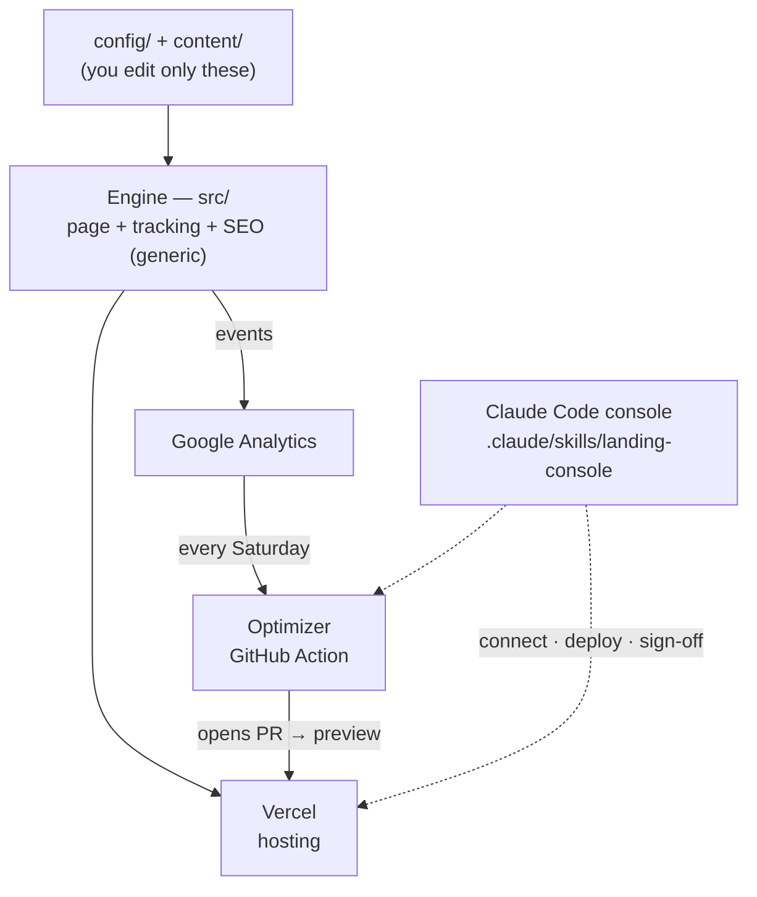

# Architecture

The guiding principle: **the engine is generic; everything client-specific is data.**
A client re-skins, re-targets, and re-words the whole page by editing `config/` and
`content/` — never `src/`.



```
┌─ Client edits ───────────────────────────────────────────────┐
│  config/site.config.ts   brand · business · GA4 · strategy    │
│  config/targets.config.ts  conversion targets ("120% of …")   │
│  content/landing.json    page copy as typed sections          │
│  .env.local              secrets (GA4, Anthropic, webhook)    │
└───────────────────────────────────────────────────────────────┘
                          │ read by
                          ▼
┌─ Engine (src/) ──────────────────────────────────────────────┐
│  app/layout.tsx   theme injection · GA4 + Consent Mode v2 ·   │
│                   Web Vitals · scroll tracking · header/footer │
│  app/page.tsx     loads variant content · renders sections ·  │
│                   emits JSON-LD                               │
│  middleware.ts    deterministic A/B variant cookie (edge)     │
│  components/sections/  Hero, Offer, FAQ, LeadForm, …          │
│  components/tracking/  TrackedSection, TrackedCTA, scroll,    │
│                        Web Vitals                            │
│  lib/  content-schema (zod) · analytics · variants · seo ·   │
│        theme · config                                        │
│  app/api/lead   webhook forward + server-side GA4 conversion  │
└───────────────────────────────────────────────────────────────┘
                          │ deploys to
                          ▼
                      Vercel (preview per PR, prod on main)
                          ▲
                          │ opens PR every Saturday
┌─ Optimizer (optimizer/) ─────────────────────────────────────┐
│  run.ts → ga4.ts → targets.ts → research.ts → optimize.ts     │
│  reads GA4 · scores targets · researches · rewrites content   │
│  validates against the SAME zod schema before writing         │
└───────────────────────────────────────────────────────────────┘
```

## Request lifecycle

1. **Edge middleware** assigns a stable `lp_variant` cookie (FNV hash → weighted
   bucket). No-op when experiments are off.
2. **`app/page.tsx`** (server) reads the variant cookie, loads + validates content
   via `lib/content.ts`, applies any per-variant overrides, and renders sections
   through `SectionRenderer`. It also injects JSON-LD.
3. Each section is wrapped in **`TrackedSection`** (fires `section_view` on
   viewport entry). CTAs are **`TrackedCTA`** (fire `cta_click` / `outbound_click`).
4. **`app/layout.tsx`** boots GA4 with Consent Mode v2, reports Web Vitals, and
   tracks scroll depth.
5. The **lead form** posts to `app/api/lead`, which forwards to the configured
   webhook and fires a server-verified GA4 conversion via the Measurement Protocol.

## The content contract

`src/lib/content-schema.ts` (zod) is the single source of truth for page shape.
It is enforced in three places:

- **Render** — invalid content throws at build/request time (fail loud).
- **Optimizer** — the AI's rewrite must pass the schema before it can be written.
- **Editor DX** — `npm run typecheck` catches mistakes in config and content.

To add a new section type: extend the schema, add a component in
`components/sections/`, and add a case to `SectionRenderer`. Nothing else changes.

## Theming

Brand colors in `site.config.ts` are converted to RGB triplets and injected as CSS
variables in `<head>` (`lib/theme.ts`), before first paint. Tailwind maps utilities
like `bg-brand` / `text-ink` to those variables — so one config edit re-skins the
entire page with no Tailwind changes.

## Why these choices

- **Next.js App Router on Vercel** — server components keep the page fast (good for
  SEO/ads quality score), middleware gives clean edge A/B bucketing, and the PR →
  preview flow is exactly how the optimizer's changes get reviewed.
- **Content as data, not JSX** — lets the AI rewrite copy safely without touching
  layout or tracking plumbing.
- **Zod everywhere** — the safety rail that makes autonomous rewrites trustworthy.
