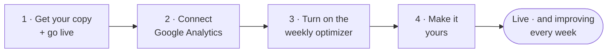
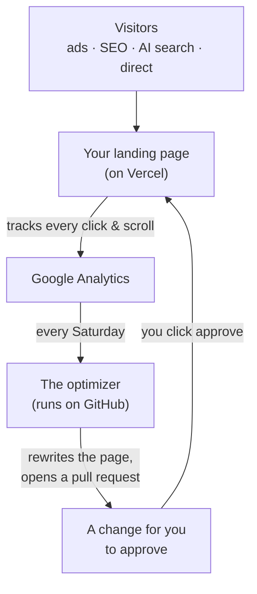
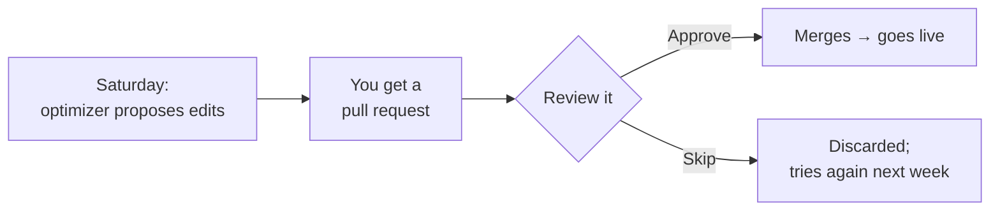

# Go-live guide — from zero to a live, self-improving landing page

This is the complete, click-by-click walkthrough. **No coding, no prior experience needed.** If you can fill in a web form and copy-paste, you can do this. Plan about **30–45 minutes** the first time.

By the end you'll have: a live landing page on your own web address, tracking every visitor, that proposes its own improvements every week for you to approve.

---

## The journey at a glance

You're live after **Step 1**. Steps 2–4 add tracking, the weekly AI, and your own offer — do them whenever you're ready.

## How it all works (once it's live)

---

## Before you start — create these free accounts

You'll need logins for these. Open each, sign up (all have free tiers), and keep the tabs open:

| Account | What it's for | Link |
| --- | --- | --- |
| **GitHub** | Stores your copy of the site | https://github.com/signup |
| **Vercel** | Hosts the live page (sign in *with GitHub* — easiest) | https://vercel.com/signup |
| **Google Analytics** | Measures your visitors | https://analytics.google.com |
| **Anthropic** *(optional, for the weekly AI)* | Powers the weekly rewrite | https://console.anthropic.com |

> 💡 **Tip:** when signing up for Vercel, choose **"Continue with GitHub."** It links the two automatically.

---

## Step 1 · Get your copy and put it live (one click)

The **"Deploy with Vercel"** button does everything at once: it makes *your own* copy of the site in *your* GitHub, creates the hosting project, and deploys it.

1. Click the **"Deploy with Vercel"** button at the top of the project's [README](../README.md).
2. Vercel asks you to **sign in / connect GitHub** — click through it. When it asks for a **repository name**, pick one (e.g. `my-landing-page`) and remember it.
3. Vercel shows an **Environment Variables** form. Fill in:
   - **`NEXT_PUBLIC_SITE_URL`** → your site's address will be `https://<the-name-you-just-chose>.vercel.app`. Type that. *(If you're not sure of the exact name, type anything for now and you'll correct it in step 5 below — it's quick.)*
   - **`NEXT_PUBLIC_GA4_MEASUREMENT_ID`** → leave blank for now (you'll add it in Step 2).
4. Click **Deploy** and wait ~1 minute. 🎉 **Your page is live** — Vercel shows you the real URL (e.g. `my-landing-page.vercel.app`). Click it to see your page.
5. **Required — confirm your real URL.** Go to **Vercel → your project → Settings → Environment Variables**. Make sure **`NEXT_PUBLIC_SITE_URL`** exactly matches the live URL from step 4 (e.g. `https://my-landing-page.vercel.app`). If you changed it, go to **Deployments → ⋯ → Redeploy**. *(This matters: it sets your page's Google/social/search links. The site is even built to **block the deploy** if this is still the default `example.com` — so don't leave it as a placeholder.)*

> **Want a custom domain (e.g. `yourbusiness.com`)?** Vercel → your project → **Settings → Domains → Add** → follow the DNS steps. **Then** repeat step 5 with your custom domain as `NEXT_PUBLIC_SITE_URL` and redeploy — otherwise your search/social links still point at the `.vercel.app` address.

> **Prefer Claude Code?** After step 4, run `git clone` on your new repo, open it in **Claude Code**, and say *"set up my landing page."* The built-in console does Steps 2–4 for you. (Everything below also works by hand — pick whichever you like.)

---

## Step 2 · Connect Google Analytics (so it can measure)

### 2a · Add your tracking ID

1. Go to https://analytics.google.com → create an **Account** + **Property** (name it after your business).
2. Create a **Web data stream** for your site URL, and copy the **Measurement ID** — it looks like **`G-XXXXXXXXXX`**.
3. In **Vercel → your project → Settings → Environment Variables**, set **`NEXT_PUBLIC_GA4_MEASUREMENT_ID`** = your `G-…` id → **Save** → **Deployments → ⋯ → Redeploy.**
4. **Mark your conversion as a "Key event"** *(don't skip this — it's what lets the weekly optimizer count conversions).* In GA4 → **Admin → Key events** → find or add **`generate_lead`** and toggle it **on**. *(`generate_lead` is the form-submit event; it's set by `conversion.conversionEventName` in `config/site.config.ts`.)*

✅ Your page now tracks visitors and counts leads.

> **Optional — for the weekly AI's deeper analysis:** in GA4 → **Admin → Custom definitions → Create custom dimension**, register two **event-scoped** dimensions named **`variant`** (parameter `variant`) and **`percent`** (parameter `percent`). Without them the optimizer still runs, but it can't measure A/B variants or scroll-depth as precisely.

### 2b · Give the weekly optimizer read-access *(only needed for the weekly AI — skip if you're not using it yet)*

This is the one fiddly part. Take it slowly — it's just clicking.

<b>Click to expand the step-by-step (Google Cloud service account)</b>

1. Go to https://console.cloud.google.com → top bar → **Select a project → New Project** → name it → **Create.**
2. Search bar → type **"Google Analytics Data API"** → open it → click **Enable.**
3. Left menu → **APIs & Services → Credentials → Create credentials → Service account.**
4. Name it (e.g. `landing-optimizer`) → **Create and continue → Done.**
5. Click the service account → **Keys** tab → **Add key → Create new key → JSON → Create.** A `.json` file downloads — **keep it safe, it's a password.**
6. Open that `.json` file in a text editor and copy the value of **`client_email`** (looks like `…@….iam.gserviceaccount.com`).
7. In **Google Analytics → Admin (gear) → Property Access Management → + → Add users** → paste that email → role **Viewer** → **Add.**
8. Still in **Admin → Property Settings**, copy the **Property ID** — a **number** like `123456789`. **This is NOT the `G-…` id** — it's the numeric one the optimizer needs.

You now have, for Step 3: the **numeric Property ID** and the **JSON key file**.

---

## Step 3 · Turn on the weekly optimizer *(optional — the page is fully live without this)*

The weekly AI runs on GitHub and needs three secrets. Add them in your repository:

1. Your repo → **Settings → Secrets and variables → Actions → New repository secret.** Add each:
   - **`ANTHROPIC_API_KEY`** → your key from https://console.anthropic.com *(this is the only ongoing cost — roughly one model run per week)*
   - **`GA4_PROPERTY_ID`** → the **numeric** Property ID from Step 2b
   - **`GA4_SERVICE_ACCOUNT_JSON`** → open the `.json` key file, copy **the entire contents**, paste it as the value
2. Let the optimizer open its weekly pull request: repo → **Settings → Actions → General → Workflow permissions** → tick **"Allow GitHub Actions to create and approve pull requests"** → **Save.**

✅ Every **Saturday**, the optimizer now reads your analytics, rewrites the page, and opens a pull request for you to approve.

> **Optional — deeper signals.** The page already tracks AI-engine traffic and ships an
> AI-readable `/llms.txt` automatically. If you want the optimizer to learn from even more,
> you can connect **PostHog** (session replay + product analytics) and **Google Search
> Console** (free SEO data) — both are optional and the weekly AI runs fine without them.
> See [SETUP.md §5d](SETUP.md) for the 5-minute steps.

---

## Step 4 · Make it yours

The site ships with an example offer. To replace it with yours:

- **Easiest — in Claude Code:** say *"make the page about my offer"* and describe what you sell. Claude researches your market and rewrites the page; you review it before anything ships.
- **By hand:** edit two files — `config/site.config.ts` (your brand, domain, and your offer/audience brief) and `content/landing.json` (the page words). Set your goals in `config/targets.config.ts`. Full reference: [CONTENT_GUIDE.md](CONTENT_GUIDE.md).

Either way: save → it auto-deploys → it's live.

---

## The weekly rhythm (about 2 minutes)

Each Saturday: open Claude Code (or GitHub), review the proposed change + why, and **Approve** or **Skip.** **Nothing ever goes live without your approval.**

---

## If something goes wrong (common fixes)

| Symptom | Fix |
| --- | --- |
| **Deploy fails with an "example.com" error** | `NEXT_PUBLIC_SITE_URL` is still the placeholder. Set it to your real URL in Vercel → Settings → Environment Variables → Redeploy (Step 1.5). |
| **Page live but no data in Google Analytics** | `NEXT_PUBLIC_GA4_MEASUREMENT_ID` isn't set, or you didn't redeploy after adding it (Step 2a). Data also takes a few hours to appear. |
| **Form says "success" but I never get the lead** | You haven't set `LEAD_WEBHOOK_URL` (where leads are sent — your CRM/Zapier/email). Until you do, leads only appear in your Vercel **function logs**. Add `LEAD_WEBHOOK_URL` as a Vercel env var to receive them. |
| **Weekly optimizer reads zero conversions** | You didn't mark the conversion as a **Key event** (Step 2a.4). |
| **Optimizer error: "permission denied" / 403 from Google** | The service-account email isn't a **Viewer** in Analytics (Step 2b.7), or you used the `G-…` id instead of the **numeric** Property ID (Step 2b.8). |
| **Optimizer runs but never opens a pull request** | The repo toggle in Step 3.2 isn't ticked. |
| **Claude says `gh` is not installed** | Optional tool. Either install it (`brew install gh`) or just use the GitHub website for the GitHub steps — this guide's manual steps cover everything. |

---

## Where to go deeper

- [GIFT-SETUP.md](GIFT-SETUP.md) — the short version of this guide
- [SETUP.md](SETUP.md) — every field and option in detail
- [OPTIMIZER.md](OPTIMIZER.md) — how the weekly loop and targets work
- [CONTENT_GUIDE.md](CONTENT_GUIDE.md) — writing your page copy
- [ARCHITECTURE.md](ARCHITECTURE.md) — how the whole thing fits together
