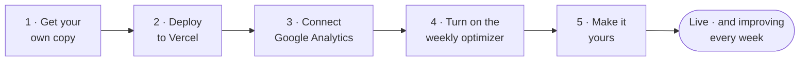
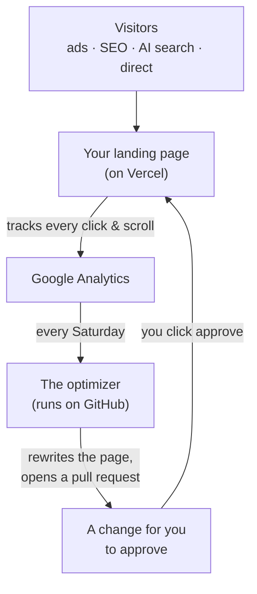
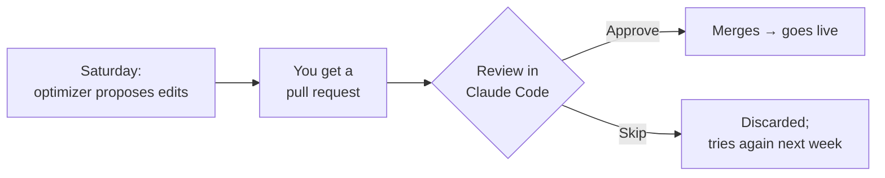

# Go-live guide — from zero to a live, self-improving landing page

This is the complete, click-by-click walkthrough. **No coding, no prior experience needed.** If you can fill in a web form and copy-paste, you can do this. Plan about **30–45 minutes** the first time.

By the end you'll have: a live landing page on your own web address, tracking every visitor, that proposes its own improvements every week for you to approve.

---

## The journey at a glance

You can stop after **Step 2** and already have a live page. Steps 3–5 add tracking, the weekly AI, and your own offer. Do them whenever you're ready.

## How it all works (once it's live)

---

## Before you start — create these free accounts

You'll need logins for these. Open each, sign up (all have free tiers), and keep the tabs open:

| Account | What it's for | Link |
| --- | --- | --- |
| **GitHub** | Stores your copy of the site | https://github.com/signup |
| **Vercel** | Hosts the live page (sign in *with GitHub* — easiest) | https://vercel.com/signup |
| **Google Analytics** | Measures your visitors | https://analytics.google.com |
| **Anthropic** *(optional, for the weekly AI)* | Powers the weekly rewrite | https://console.anthropic.com |

> 💡 **Tip:** when signing up for Vercel, choose **"Continue with GitHub."** It links the two automatically and saves you a step later.

---

## Step 1 · Get your own copy of the site

You need your *own* copy in *your* GitHub account.

1. Go to the project's GitHub page.
2. Click the green **"Use this template"** button → **"Create a new repository."**
3. Give it a name (e.g. `my-landing-page`), choose **Public** *(required for the one-click deploy)*, and click **"Create repository."**

✅ You now have your own copy. You'll never edit code by hand — you'll either click buttons or ask Claude.

> **Doing this in Claude Code?** Just say: *"make this my own repo and push it."* Claude does Step 1 for you.

---

## Step 2 · Deploy it (this makes it live)

1. In your new repository, open the **`README.md`** file and click the **"Deploy with Vercel"** button. *(Or paste the deploy link from the README into your browser.)*
2. Vercel asks you to **connect your GitHub** and clone the repo — click through it.
3. Vercel shows an **Environment Variables** form. Fill in:
   - **`NEXT_PUBLIC_SITE_URL`** → type the address Vercel is about to give you. If you don't know it yet, put `https://temp.vercel.app` and fix it in a minute (see the heads-up below).
   - **`NEXT_PUBLIC_GA4_MEASUREMENT_ID`** → leave blank for now (you'll add it in Step 3).
4. Click **Deploy.** Wait ~1 minute. 🎉 **Your page is live** — Vercel shows you the URL (something like `your-project.vercel.app`).

> ⚠️ **Heads up — the site URL must be real.** The site is built to *refuse to deploy in production* if `NEXT_PUBLIC_SITE_URL` is left as a placeholder (so you never accidentally ship a half-set-up page). After the first deploy, go to **Vercel → your project → Settings → Environment Variables**, set `NEXT_PUBLIC_SITE_URL` to your actual `*.vercel.app` URL (or your custom domain), then **Deployments → ⋯ → Redeploy.**

> **Want a custom domain?** Vercel → your project → **Settings → Domains → Add** → type your domain → follow the DNS instructions it gives you.

> **Doing this in Claude Code?** Say *"deploy my landing page."* Claude generates your exact deploy link and walks you through it.

---

## Step 3 · Connect Google Analytics (so it can measure)

Two small parts: a tracking ID for the page, and (for the weekly AI) read-access for the optimizer.

### 3a · Get your Measurement ID

1. Go to https://analytics.google.com → if it's your first time, create an **Account** and a **Property** (name it after your business).
2. When asked, create a **Web data stream** and enter your site URL.
3. Copy the **Measurement ID** — it looks like **`G-XXXXXXXXXX`**.
4. Put it into Vercel: **your project → Settings → Environment Variables** → set **`NEXT_PUBLIC_GA4_MEASUREMENT_ID`** = your `G-…` id → **Save** → **Redeploy.**

✅ Your page now tracks visitors.

### 3b · Give the weekly optimizer read-access *(only needed for the weekly AI — skip if you're not using it yet)*

This is the one fiddly part. Take it slowly — it's just clicking.

<b>Click to expand the step-by-step (Google Cloud service account)</b>

1. Go to https://console.cloud.google.com → top bar → **Select a project → New Project** → name it → **Create.**
2. Search bar → type **"Google Analytics Data API"** → open it → click **Enable.**
3. Left menu → **APIs & Services → Credentials → Create credentials → Service account.**
4. Give it a name (e.g. `landing-optimizer`) → **Create and continue → Done.**
5. Click the service account you just made → **Keys** tab → **Add key → Create new key → JSON → Create.** A `.json` file downloads — **keep it safe, it's a password.**
6. Open that `.json` file in a text editor and copy the value of **`client_email`** (looks like `…@….iam.gserviceaccount.com`).
7. Back in **Google Analytics → Admin (gear icon) → Property Access Management → + (top right) → Add users** → paste that email → role **Viewer** → **Add.**
8. Still in **Admin → Property Settings**, copy the **Property ID** — this is a **number** like `123456789`. **This is NOT the `G-…` id** — it's the numeric one the optimizer needs.

You now have two things for Step 4: the **numeric Property ID** and the **JSON key file**.

> **Doing this in Claude Code?** Say *"connect my Google Analytics."* Claude walks you through each click and stores the values for you.

---

## Step 4 · Turn on the weekly optimizer *(optional — the page is fully live without this)*

The weekly AI runs on GitHub and needs three secrets. Add them in your repository:

1. Your repo → **Settings → Secrets and variables → Actions → New repository secret.** Add each of these:
   - **`ANTHROPIC_API_KEY`** → your key from https://console.anthropic.com *(this is the only ongoing cost — roughly one model run per week)*
   - **`GA4_PROPERTY_ID`** → the **numeric** Property ID from Step 3b
   - **`GA4_SERVICE_ACCOUNT_JSON`** → open the `.json` key file, copy **the entire contents**, paste it as the value
2. Let the optimizer open its weekly pull request: repo → **Settings → Actions → General → Workflow permissions** → tick **"Allow GitHub Actions to create and approve pull requests"** → **Save.**

✅ Every **Saturday**, the optimizer now reads your analytics, rewrites the page, and opens a pull request for you to approve.

> **Doing this in Claude Code?** Say *"finish my GitHub setup."* Claude sets all three secrets and flips the toggle for you.

---

## Step 5 · Make it yours

The site ships with an example offer. To replace it with yours:

- **Easiest — in Claude Code:** say *"make the page about my offer"* and describe what you sell. Claude researches your market and rewrites the page; you review it before anything ships.
- **By hand:** edit two files — `config/site.config.ts` (your brand, domain, and your offer/audience brief) and `content/landing.json` (the page words). Set your goals in `config/targets.config.ts`. Full reference: [CONTENT_GUIDE.md](CONTENT_GUIDE.md).

Either way: commit/save → it auto-deploys → it's live.

---

## The weekly rhythm (about 2 minutes)

Each Saturday: open Claude Code, say *"show this week's proposed edits,"* read the change + why, and click **Approve** or **Skip.** **Nothing ever goes live without your approval.**

---

## If something goes wrong (common fixes)

| Symptom | Fix |
| --- | --- |
| **Deploy fails with an "example.com" error** | `NEXT_PUBLIC_SITE_URL` is still the placeholder. Set it to your real URL in Vercel → Settings → Environment Variables → Redeploy. (Step 2 heads-up.) |
| **Page is live but no data in Google Analytics** | `NEXT_PUBLIC_GA4_MEASUREMENT_ID` isn't set, or you didn't redeploy after adding it. Re-check Step 3a. Data also takes a few hours to appear. |
| **Weekly optimizer error: "permission denied" / 403 from Google** | You didn't add the service-account email as a **Viewer** in Analytics (Step 3b.7), or you used the `G-…` id instead of the **numeric** Property ID (Step 3b.8). |
| **Weekly optimizer runs but never opens a pull request** | The repo toggle in Step 4.2 isn't ticked. Turn on "Allow GitHub Actions to create and approve pull requests." |
| **Claude says `gh` is not installed** | Optional tool. Either install it (`brew install gh`) or just use the GitHub website for the few GitHub steps — the guide's manual steps cover everything. |

---

## Where to go deeper

- [GIFT-SETUP.md](GIFT-SETUP.md) — the short version of this guide
- [SETUP.md](SETUP.md) — every field and option in detail
- [OPTIMIZER.md](OPTIMIZER.md) — how the weekly loop and targets work
- [CONTENT_GUIDE.md](CONTENT_GUIDE.md) — writing your page copy
- [ARCHITECTURE.md](ARCHITECTURE.md) — how the whole thing fits together
